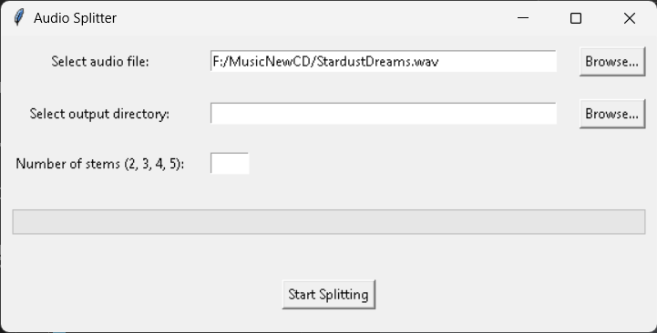
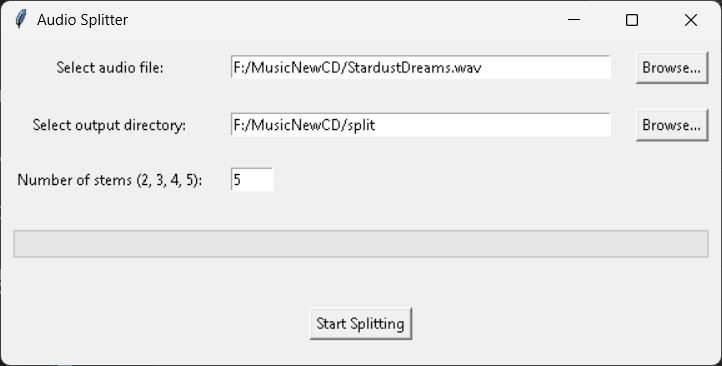
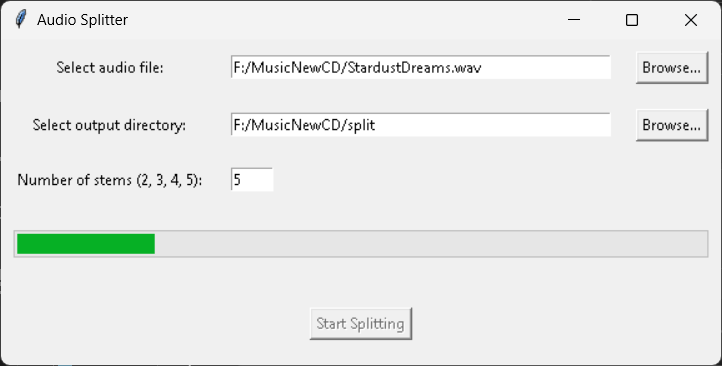

# DF Audio Splitter

This project is a graphical user interface (GUI) for splitting audio files into individual stems (vocals, drums, bass, etc.) using the Spleeter library by Deezer. The application allows users to select an audio file, choose the output directory, specify the number of stems, and monitor the progress of the splitting process.

**Have you used Suno or another AI music generator? Do you need your tracks split so you can use them in your own DAW? Well, this is free, open-source, and easy to use. There's a CLI option for people who like that sort of thing, and there's a GUI for those who don't want to play around with command line stuff. (Two flavors... One great taste.)**

**Plus, the step-by-step instructions make it a snap to set up even if you never touched a Python program before. :D**

**Most of all have fun with this!**


## Features

- Select audio files in various formats (MP3, WAV, FLAC, M4A, WMA).
- Choose the number of stems to split into (2, 3, 4, or 5).
- Monitor progress with a progress bar.
- Notifications upon successful completion.

## Requirements

- Python 3.10+
- Tkinter
- Spleeter
- TensorFlow

**Please note**: You may need to download https://www.dllme.com/dll/files/zlibwapi if you get an error that Zlib is missing. Just put it in to your Scripts directory after you make your venv! (Always make a VENV please! It can save you some heartache in the long run!)

## Installation

1. **Clone the repository:**

    ```bash
    git clone https://github.com/donaldafeith/DF-Audio-Splitter.git
    cd DF-Audio-Splitter
    ```

2. **Create and activate a virtual environment:**

    ```bash
    python -m venv venv
    source venv/bin/activate  # On Windows: venv\Scripts\activate
    ```

3. **Install the required packages:**

    ```bash
    pip install -r requirements.txt
    ```

## Usage

1. **Run the application:**

    ```bash
    python audio_splitter_gui.py
    ```

2. **Use the GUI to:**

    - Select an audio file.
    - Choose the output directory.
    - Specify the number of stems (2, 3, 4, or 5).
    - Click "Start Splitting" to begin the process.

## File Structure

- `audio_splitter_gui.py`: Main script containing the GUI implementation.
- `requirements.txt`: List of required packages.

## Example

1. **Select an audio file:**

    

2. **Choose the output directory:**

    

3. **Specify the number of stems:**

    

4. **Monitor the progress:**

    

## Contributing

Contributions are welcome! Please open an issue or submit a pull request for any improvements or bug fixes.

## License

This project is licensed under the Apache License 2.0. See the `LICENSE` file for details.

